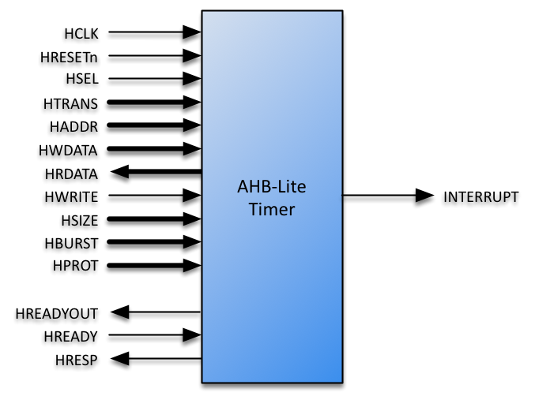
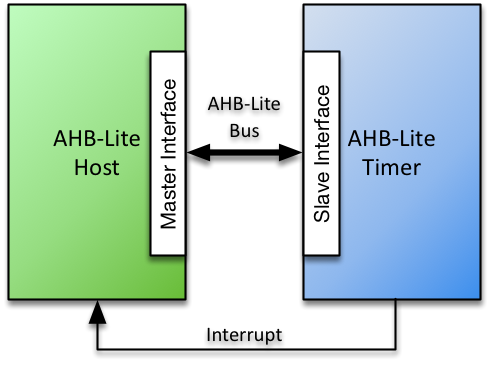

# AHB-Lite Timer Datasheet

## Contents

-   [Product Brief](#product-brief)
-   [Specification](#specifications)
-   [Configuration](#configurations)
-   [Interfaces](#interfaces)
-   [Resources](#resources)
-   [Revision History](#revision-history)

## Product Brief

The Roa Logic AHB-Lite Timer IP is a fully parameterized soft IP implementing a user-defined number of timers and functions as specified by the RISC-V Privileged 1.9.1 specification.

The IP features an AHB-Lite Slave interface, with all signals defined in the *AMBA 3 AHB-Lite v1.0* specifications fully supported, supporting a single AHB-Lite based host connection. Bus address & data widths as well as the number of timers supported are specified via parameters.

The timebase of the timers is derived from the AHB-Lite bus clock, scaled down by a programmable value.

The module features a single Interrupt output which is asserted whenever an enabled timer is triggered

### Features

-   AHB-Lite Interface with programmable address and data width

-   User defined number of counters (Up to 32)

-   Programmable time base derived from AHB-Lite bus clock

## Specification

### Functional Description

The AHB-Lite Timer IP is a fully parameterised Timer-tick core, featuring a single AHB-Lite Slave interface and a single multiplexed Interrupt output signal.

The Timer IP is intended to generate CPU interrupts at regular time intervals, for timed events such as time keeping, task/context switches, and sleep().

The number of timers and Address & Data width of the AHB-Lite interface are specified via parameters defined at compile time.

The time base of the timers is common to all timers and defined at runtime by writing to the `PRESCALER` register. Individual timer alarms may then set via the `TIMECMP[n]` registers. All timers are permanently enabled however a separate `IENABLE` register allows any triggered counter output to be masked.

The user may determine both the status of the `TIMERS` including which timer has generated an interrupt via a read operation to the AHB-Lite interface.

## Configuration

### Introduction

The size and implementation style of the timer module is defined via HDL parameters as specified below.

### Core Parameters

| Parameter    |   Type  | Default | Description                   |
|:-------------|:-------:|:-------:|:------------------------------|
| `TIMERS`     | Integer |    3    | Number of Timers              |
| `HADDR_SIZE` | Integer |    32   | Width of AHB-Lite Address Bus |
| `HDATA_SIZE` | Integer |    32   | Width of AHB-Lite Data Buses  |

#### TIMERS

The parameter `TIMERS` defines the number of timers supported and thereby the number of `TIMECMP` registers implemented by the core. Values between 1 and 32 are supported, with the default defined as ‘3’.

#### HADDR\_SIZE

The `HADDR_SIZE` parameter specifies the address bus size to connect to the AHB-Lite based host.

#### HDATA\_SIZE

The `HDATA_SIZE` parameter specifies the data bus size to connect to the AHB-Lite based host. The maximum size supported is 64 bits.

### Core Registers

| Register     | Address        | Size   | Access     | Function          |
|:-------------|:---------------|:-------|:-----------|:------------------|
| `PRESCALER`  | Base + 0x00    | 32bits | Read/Write | Timebase          |
| `IPENDING`   | Base + 0x08    | 32bits | Read Only  | Interrupt Pending |
| `IENABLE`    | Base + 0x0C    | 32bits | Read/Write | Interrupt Enable  |
| `TIME`       | Base + 0x10    | 64bits | Read/Write | Timer Register    |
| `TIMECMP[n]` | Base + 0x18+8n | 64bits | Read/Write | Compare Value     |

Note: ‘n’ represents an integer for 0 to TIMERS-1.

#### PRESCALER

The Timer module operates synchronously with the AHB-Lite bus clock input `HCLK`. A 32 bit `PRESCALER` register enables the time base for the timers to be less than that of `HCLK` by dividing this clock frequency by the value of `PRESCALER` + 1.

For example: If `PRESCALER`=3, the timer will increment every `PRESCALER`+1=4 cycles of HCLK, setting the time base to HCLK/4 Hz.

The default value of `PRESCALER`=0, thereby setting the timer clock frequency equal to the bus (`HCLK`) frequency. The TIME counter starts incrementing once the register `PRESCALER` is written to for the first time.

Note: The value of `PRESCALER` value can only be defined once after the peripheral is released from reset.

#### IPENDING

`IPENDING` is a 32-bit read-only register that indicates if a timer interrupt is pending.

Each bit of the `IPENDING` register corresponds to one timer with the position of each bit indicating the associated timer. E.g. bit zero indicates the interrupt status of `Timer[0]`. `IPENDING` bits associated with unimplemented timers are tied low (‘0’)

An interrupt pending bit is set when the value of `TIMECMP[n]` equals the value of `TIME`. It is cleared by a write to the associated `TIMECMP[n]` register, as specified in the RISC-V privileged spec 1.9.1.

#### IENABLE

`IENABLE` is a 32-bit Read/Write register, where each bit of the register is a dedicated ’Interrupt Enable’ bit for each time. The bit position indicates the associated timer. E.g. Interrupt Enable for `Timer[0]` is located at bit position 0.

Only `TIMERS` bits are implemented with the remaining MSBs always read as ’0’. A write to the unused MSBs has no effect.

An interrupt is generated when a bit of `IPENDING` is set and its associated `IENABLE` bit is also set. This allows the core to be used in (1) pure POLL mode, where the CPU polls the status of the bits to determine if a timer event happened, (2) pure interrupt driven mode, where each timer can generate an interrupt, or (3) a combination of the above.

#### TIME

The `TIME` register is a common 64-bit high-resolution time-keeping counter used by all timers. It is the basis for the `RDCYCLE` instruction as specified in the RISC-V privileged spec 1.9.1 and may be written to also in accordance with the RISC-V specification.

The time base for the `TIME` register is derived from the AHB-Lite bus clock `HCLK` and is defined as:

FreqTIME = FreqHCLK / (`PRESCALER`+1)

The counter starts incrementing once the register `PRESCALER` is written to for the first time.

#### TIMECMP\[n\]

For each timer (as defined by the parameter `TIMER`) there is a dedicated 64 bit Time Compare register which defines when the `IPENDING` bits are asserted

These registers are denoted as `TIMECMP[n]`, where ‘n’ is an index from 0 to `TIMERS`-1, and are located consecutively in the address space according to the formula:

Base Address of `TIMECMP[n] = 0x18 + 8n`

For example, `TIMECMP[0]` is located at address `0x18`, `TIMECMP[1]` at `0x20`, `TIMECMP[5]` at `0x28` etc.

The `IPENDING` bit associated with the `TIMECMP` register is set when the `TIMECMP[n]` value equals the value of `TIME`.

`IPENDING[n] = (TIMECMP[n] == TIME)`

Writing the `TIMECMP[n]` register clears bit ‘n’ of the `IPENDING` register.

## Interfaces

### AHB-Lite Interface

The AHB-Lite interface is a regular AHB-Lite slave port. All signals are supported. See the *[AMBA 3 AHB-Lite Specification](https://www.arm.com/products/system-ip/amba-specifications)* for a complete description of the signals.

|   **Port**  |   **Size**   | **Direction** | **Description**               |
|:-----------:|:------------:|:-------------:|:------------------------------|
|  `HRESETn`  |       1      |     Input     | Asynchronous active low reset |
|    `HCLK`   |       1      |     Input     | Clock Input                   |
|    `HSEL`   |       1      |     Input     | Bus Select                    |
|   `HTRANS`  |       2      |     Input     | Transfer Type                 |
|   `HADDR`   | `HADDR_SIZE` |     Input     | Address Bus                   |
|   `HWDATA`  | `HDATA_SIZE` |     Input     | Write Data Bus                |
|   `HRDATA`  | `HDATA_SIZE` |     Output    | Read Data Bus                 |
|   `HWRITE`  |       1      |     Input     | Write Select                  |
|   `HSIZE`   |       3      |     Input     | Transfer Size                 |
|   `HBURST`  |       3      |     Input     | Transfer Burst Size           |
|   `HPROT`   |       4      |     Input     | Transfer Protection Level     |
| `HREADYOUT` |       1      |     Output    | Transfer Ready Output         |
|   `HREADY`  |       1      |     Input     | Transfer Ready Input          |
|   `HRESP`   |       1      |     Output    | Transfer Response             |

#### HRESETn

When the active low asynchronous `HRESETn` input is asserted (‘0’), the interface is put into its initial reset state.

#### HCLK

`HCLK` is the interface system clock. All internal logic for the AHB-Lite interface operates at the rising edge of this system clock and AHB bus timings are related to the rising edge of `HCLK`.

#### HSEL

The AHB-Lite interface only responds to other signals on its bus – with the exception of the global asynchronous reset signal `HRESETn` – when `HSEL` is asserted (‘1’). When `HSEL` is negated (‘0’) the interface considers the bus `IDLE`.

#### HTRANS

HTRANS indicates the type of the current transfer as shown in the table below:

| **`HTRANS`** | **Type** | **Description**                                                                          |
|:------------:|:--------:|:-----------------------------------------------------------------------------------------|
|     `00`     |  `IDLE`  | No transfer required                                                                     |
|     `01`     |  `BUSY`  | Connected master is not ready to accept data, but intents to continue the current burst. |
|     `10`     | `NONSEQ` | First transfer of a burst or a single transfer                                           |
|     `11`     |   `SEQ`  | Remaining transfers of a burst                                                           |

#### HADDR

`HADDR` is the address bus. Its size is determined by the `HADDR_SIZE` parameter and is driven to the connected peripheral.

#### HWDATA

`HWDATA` is the write data bus. Its size is determined by the `HDATA_SIZE` parameter and is driven to the connected peripheral.

#### HRDATA

`HRDATA` is the read data bus. Its size is determined by the `HDATA_SIZE` parameter and is sourced by the connected peripheral.

#### HWRITE

`HWRITE` is the read/write signal. `HWRITE` asserted (‘1’) indicates a write transfer.

#### HSIZE

`HSIZE` indicates the size of the current transfer as shown in table \[tab:HSIZE\]:

| **`HSIZE`** | **Size** | **Description** |
|:-----------:|:--------:|:----------------|
|    `000`    |   8 bit  | Byte            |
|    `001`    |  16 bit  | Half Word       |
|    `010`    |  32 bit  | Word            |
|    `011`    |  64 bits | Double Word     |
|    `100`    |  128 bit |                 |
|    `101`    |  256 bit |                 |
|    `110`    |  512 bit |                 |
|    `111`    | 1024 bit |                 |

#### HBURST

HBURST indicates the transaction burst type – a single transfer or part of a burst.

| **`HBURST`** | **Type** | **Description**              |
|:------------:|:--------:|:-----------------------------|
|     `000`    | `SINGLE` | Single access                |
|     `001`    |  `INCR`  | Continuous incremental burst |
|     `010`    |  `WRAP4` | 4-beat wrapping burst        |
|     `011`    |  `INCR4` | 4-beat incrementing burst    |
|     `100`    |  `WRAP8` | 8-beat wrapping burst        |
|     `101`    |  `INCR8` | 8-beat incrementing burst    |
|     `110`    | `WRAP16` | 16-beat wrapping burst       |
|     `111`    | `INCR16` | 16-beat incrementing burst   |

#### HPROT

The `HPROT` signals provide additional information about the bus transfer and are intended to implement a level of protection.

| **Bit\#** | **Value** | **Description**                |
|:---------:|:---------:|:-------------------------------|
|     3     |     1     | Cacheable region addressed     |
|           |     0     | Non-cacheable region addressed |
|     2     |     1     | Bufferable                     |
|           |     0     | Non-bufferable                 |
|     1     |     1     | Privileged Access              |
|           |     0     | User Access                    |
|     0     |     1     | Data Access                    |
|           |     0     | Opcode fetch                   |

#### HREADYOUT

`HREADYOUT` indicates that the current transfer has finished. Note, for the AHB-Lite PLIC this signal is constantly asserted as the core is always ready for data access.

#### HREADY

`HREADY` indicates whether or not the addressed peripheral is ready to transfer data. When `HREADY` is negated (‘0’) the peripheral is not ready, forcing wait states. When `HREADY` is asserted (‘1’) the peripheral is ready and the transfer completed.

#### HRESP

`HRESP` is the instruction transfer response and indicates OKAY (‘0’) or ERROR (‘1’).

### Timer Interface

#### TIMER\_INTERRUPT

`TIMER_INTERRUPT` is a single output signal that is asserted the following conditions are both met:

1.  Any bit of the `IPENDING` register is asserted

2.  The corresponding bit of the `IENABLE` register is also asserted.

This may also be written as:

`TIMER_INTERRUPT <= IPENDING & IENABLE`

## Resources

Below are some example implementations for various platforms. All implementations are push button, no effort has been undertaken to reduce area or improve performance.

| Platform | DFF | Logic Cells | Memory | Performance (MHz) |
|:---------|:---:|:-----------:|:------:|:-----------------:|
|          |     |             |        |                   |
|          |     |             |        |                   |
|          |     |             |        |                   |

(This table will be updated in future revisions of the datasheet)

## Revision History

| Date        | Rev. | Comments        |
|:------------|:----:|:----------------|
| 24-Oct-2017 |  1.0 | Initial Release |
|             |      |                 |
|             |      |                 |
|             |      |                 |
